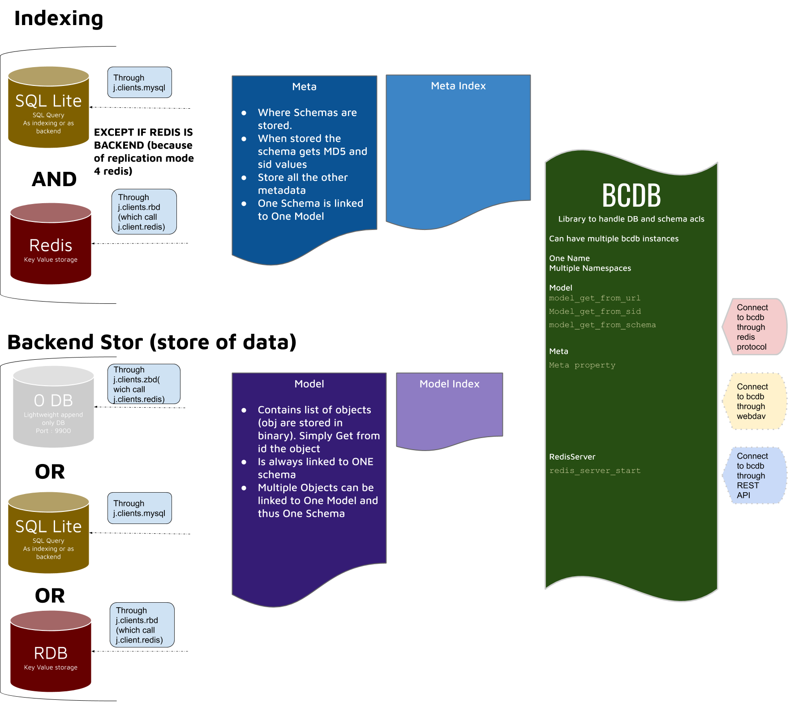

- [bcdb](bcdb.md)
- [bcdb_intro](bcdb_intro.md)
- [bcdb_model](bcdb_model.md)  :   how to work with model obj of bcdb, is where the set/get/find ... happens

# main objects

## Jumpscale/data/types/JSXObjectTypeFactory.py =  a JSX type manager manages JSXObject's

- is managing the type for a JSXObject, knows how to check, clean, serialze, ...
- knowns the schema and optionally the model attached to it (which knows the sid)
- inherits from j.data.types._TypeBaseObjClass  (good to check type)
  
## JSXObject   = is the result of using our schema, is a strongly typed object

- can create by using the j.data.types.object.clean(...)  the above type manager
- inherits from j.data.schema._JSXObjectClass  use ```isinstance(obj,j.data.schema._JSXObjectClass)``` to test is right object or ```j.data.types.object.check(```
- main properties
    - _schema 
    - _changed_items : when items got modified on the object
- properties only relevant when model used
    - id : the unique id of the object, is None when no _model
    - nid : namespace id, default 1, only relevant when _model used, is to store data in multiple namespaces
    - _autosave  : means when property changed will automatically save in the model
    - _model (is optional, a JSX object is not always stored in a model)
    - acl: will show the access control list
- main methods
    - _data_update : update the data of the object starting from a dict

- there are many more methods & properties but above ones important for developer to not have double usage

- it should be the only object which stores stronly typed data in JSX way

## Schema

- knows how to create an JSXObject which is represented by JSXObject
- its the defintion of the schema
- its independent of model


## Jumpscale/data/bcdb/BCDBModel.py

- knows how to deal with one model in BCDB
- deals with set/get/list/...

- main properties
  - sid: has link to sid = schemaid
  - schema: knows which schema to use
  - 